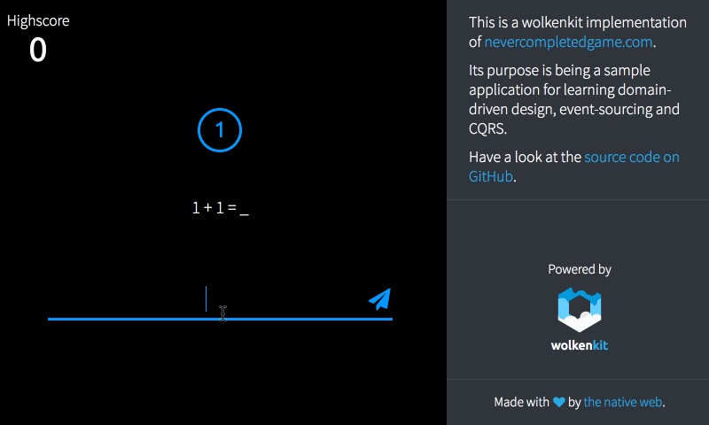

# wolkenkit-nevercompletedgame

wolkenkit-nevercompletedgame is a wolkenkit implementation of [nevercompletedgame.com](https://www.nevercompletedgame.com/).



## What is wolkenkit?

> wolkenkit is a CQRS and event-sourcing framework for JavaScript and Node.js. wolkenkit uses an event-driven model based on DDD to setup an API for your business in no time. This way, wolkenkit bridges the language gap between your domain and technology.
>
> [wolkenkit.io](https://www.wolkenkit.io/)

For more details on wolkenkit see the [wolkenkit documentation](https://docs.wolkenkit.io).

## Installation

To run a wolkenkit application, you first need to install wolkenkit. For this, see the installation guide for [macOS](https://docs.wolkenkit.io/latest/getting-started/installing-wolkenkit/installing-on-macos/), [Linux](https://docs.wolkenkit.io/latest/getting-started/installing-wolkenkit/installing-on-linux/), [Windows](https://docs.wolkenkit.io/latest/getting-started/installing-wolkenkit/installing-on-windows/), or [Docker Machine](https://docs.wolkenkit.io/latest/getting-started/installing-wolkenkit/installing-using-docker-machine/).

Additionally, to be able to run the client, you need to install `roboter-cli` globally:

```shell
$ npm install -g roboter-cli
```

## Quick start

First you need to start the nevercompletedgame wolkenkit application. Change to the directory where you have installed the application to, and run the following command:

```shell
$ wolkenkit start
```

Once you get the message that the wolkenkit application is running, change to the `client` directory, run `npm install`, and then run the client application using the following command:

```shell
$ bot serve
```

## License

Copyright (c) 2017 the native web.

This program is free software: you can redistribute it and/or modify it under the terms of the GNU Affero General Public License as published by the Free Software Foundation, either version 3 of the License, or (at your option) any later version.

This program is distributed in the hope that it will be useful, but WITHOUT ANY WARRANTY; without even the implied warranty of MERCHANTABILITY or FITNESS FOR A PARTICULAR PURPOSE. See the GNU Affero General Public License for more details.

You should have received a copy of the GNU Affero General Public License along with this program. If not, see [GNU Licenses](http://www.gnu.org/licenses/).
